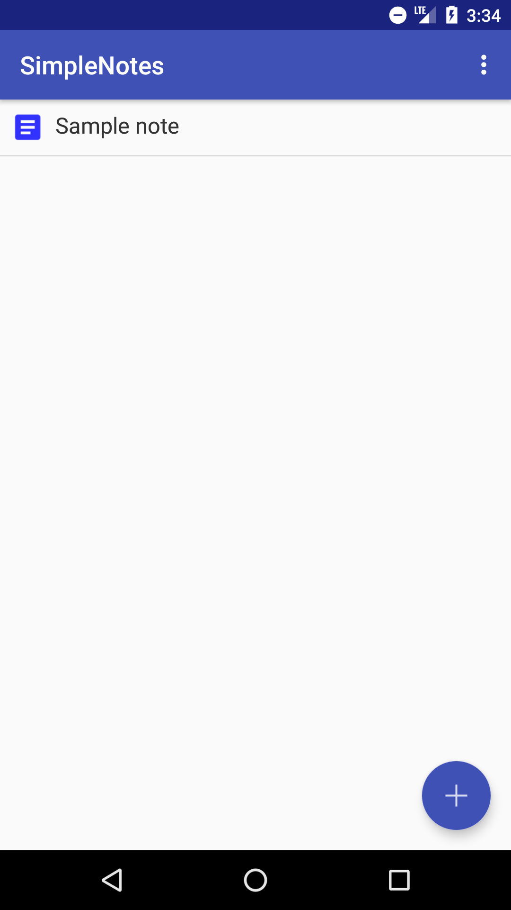
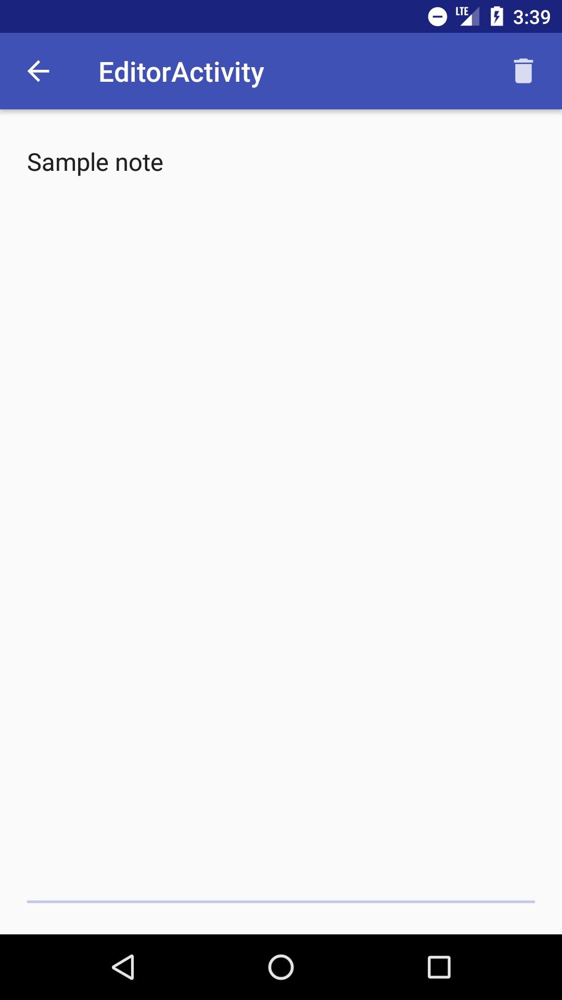

# SimpleNotes
This is a note-taking Android application that is very easy to use and does not require an internet connection. I developed this application keeping the utmost simplicity of design in mind and having only the most essential features required of a notes application.

## Features
It contains of two activities, or screens: the first one as the app launches is a list of the notes that the user has created until now and the second one is where the user can enter text to create a new note or edit an existing note.
### Notes List Screen

### Note-Editing Screen

On top of this, the user can create sample notes, delete all notes, or delete a single note.

## Technical Details
The notes are saved persistently using an SQLite database which saves all notes and related information locally on the Android device's internal storage (this means that this app can be used without an internet connection). While the app is running, the app loads data from the database asynchronously to prevent blocking the main UI thread using the Android Loader API.
